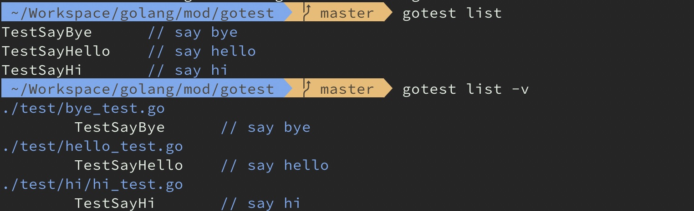
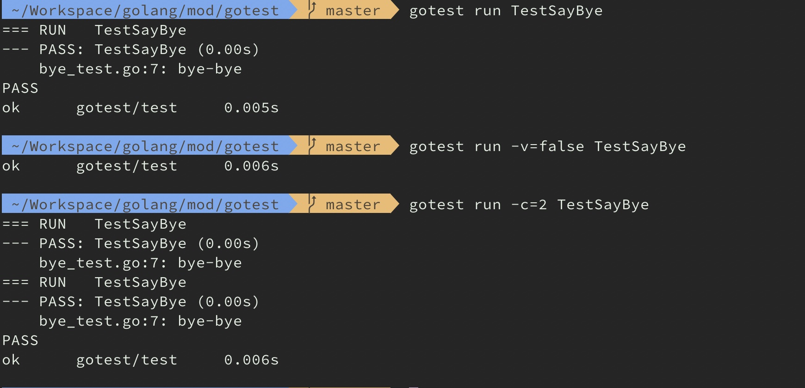

# gotest

go test的辅助工具。

#### 功能：

- [x] 列出当前目录下所有Test方法
- [x] 指定名称执行相应的Test方法


#### 示例：

```
go test 帮助工具

Usage:
  gotest [command]

Available Commands:
  help        Help about any command
  list        列出本项目所有case
  run         just run

Flags:
  -h, --help   help for gotest

Use "gotest [command] --help" for more information about a command.
```

**gotest list**



**gotest run**



